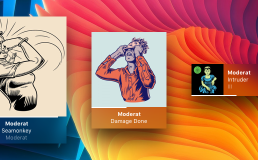
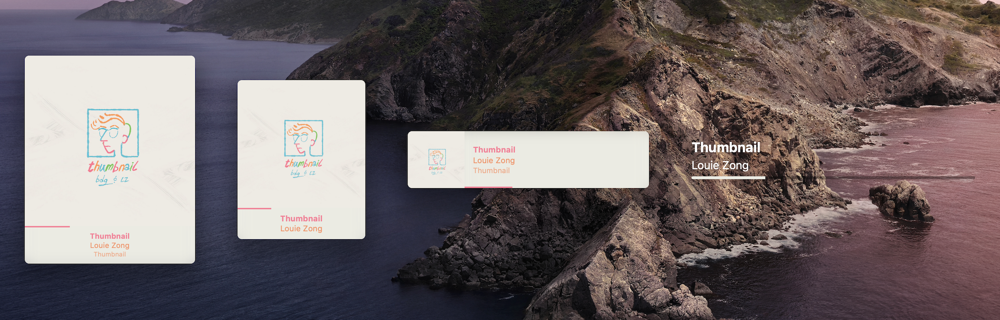
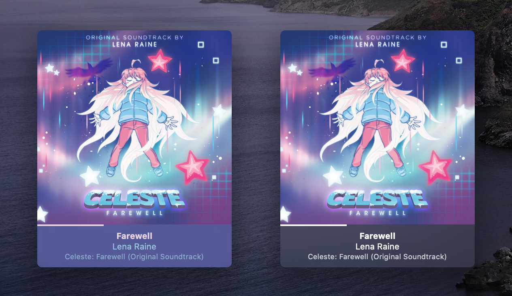

# UeberPlayer
An [Übersicht](http://tracesof.net/uebersicht/) widget that displays the currently playing song in a rather nice way. Forked from [Pe8er's Playbox](https://github.com/Pe8er/Playbox.widget), but rewritten with a bunch of new features and customization. I ended up liking this a lot to build it up again~



## Features
- Supports Apple Music and Spotify
- Comes in 4 different sizes
- Displays artwork (all done locally when possible for both platforms)
- Temporarily caches artwork for offline use and quicker loading
- Adaptive colors! (thanks to [Color Thief](https://lokeshdhakar.com/projects/color-thief/))
- Hides itself when nothing is playing
- Completely rewritten in JSX and streamlined Applescript
- Quite customizable

## Installation
You can download the `UeberPlayer.widget.zip` file from the repo, clone the repo and download it from there, or grab the zip from the [latest release](https://github.com/acluelessdanny/ueberplayer/releases/latest).

Drop the folder in your widgets folder, refresh, and profit.

## Settings
Open `index.jsx` and there'll be an `options` object for customization. Mess around with those settings to your heart's content. Here's what it generally looks like and what you can change with them:

```js
const options = {
  /* Widget size! */
  size: "big",                  // -> big (default) | medium | small | mini

  /* Widget position! */
  verticalPosition: "top",      // -> top (default) | center | bottom | "<number>" | "-<number>"
  horizontalPosition: "left",   // -> left (default) | center | right | "<number>" | "-<number>"

  /* Adaptive colors! */
  adaptiveColors: true,         // -> true (default) | false
  minContrast: 2.6,             // -> 2.6 (default) | number

  /* Dual-colored progress bar! */
  dualProgressBar: false,       // -> true | false (default)

  /* Cache setting! */
  cacheMaxDays: 15              // 15 (default) | <number>
}
```

### Size
Select from one of the 4 available sizes by setting `size`:
- `big` (default): Big and bold player!
- `medium`: Slightly smaller version of the big player, with more concise information.
- `small`: Horizontal-like player. Smaller but pretty colorful.
- `mini`: Much more minimalistic setup with a big progress bar



### Positioning
`verticalPosition` and `horizontalPosition` allow you to position the player in different areas of the screen.

They also allow number values (enclosed as a string) for pixel measurements from a screen's border. Using negative numbers (including -0) will position the player from the opposite side.

- `verticalPosition`: `top` (default), `center`, `bottom`, `"<number>"`, `"-<number>"`
- `horizontalPosition`: `left` (default), `center`, `right`, `"<number>"`, `"-<number>"`
  - If you're using the mini player, this setting will also affect its text alignment

> Note: When using number values, make sure they're enclosed in quotes, like `"5"`, `"-10"`, etc.

### Adaptive colors
You can have adaptive colors based on the current track's artwork! If you're worried about performance, there's no need to worry because it performs this process only when the track changes (though you're free to disable it for whatever reason).

You can also set the minimum contrast (`minContrast`) the text and background must be for a color to be used when extracting them. This _won't_ modify the colors selected, but rather the selection of colors (in other words, different values can yield different color combos). The default value should be good on its own, but you can tweak it to your needs. The higher the value, the more contrast it'll attempt to achieve (a good place to test and read up about it is with the [Contrast Ratio site](https://contrast-ratio.com/)).

- `adaptiveColors`: `true` (default), `false`
- `minContrast`: `2.6` (default), `<number>`
  - This can be any number, but 0-21 are the only values with actual effect, where 0 means equal colors and 21 is black and white. I made my tests and settled on **2.6**, but W3 recommends up to **4.5**. It's up to you~



> Note: You might need to refresh your widget after changing this setting.

### Progress bar
You can choose to have a dual-colored progress bar. The second color is applied on the "empty" area.

- `dualProgressBar`: `true`, `false` (default)


> Note: The mini player will always have its "empty" area, but this setting will add some color to it.

### Caching
This widget caches artwork images for quicker loading & offline usage. To help manage space, every time you load or refresh this widget, it checks the cache for any "old" artwork (from albums you haven't played in a while) and deletes them.

This setting sets how many days old the artwork must be for it to be deleted from the cache. For example, setting `5` means any album that hasn't been played for 5 days will be deleted. Setting it to `0` means it'll delete the cache completely every time it loads.

- Update README`cacheMaxDays`: `15` (default), `<number>`

## Developing
Just in case someone's curious on developing this as well, I have a `gulp dev` script here so it can streamline development a bit. Simply run `npm i` beforehand.
